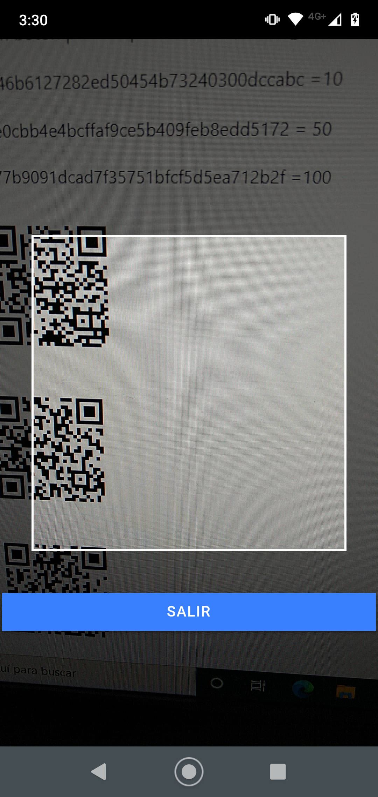

# ionic_Carga_de_credito
<table>
  <tr>
    <td></td>
    <td></td>
  </tr>
</table>

Ingresar un usuario. (registrado en BD) 
La aplicación permite escanear un código QR (encriptado) que acumula créditos. 
Si el código no se cargó, se le agrega el crédito correspondiente, que se acumulará en un visor de créditos. 
Si ya lo cargó, mostrará un mensaje que indique lo sucedido y no se permitirá la carga del crédito. 
Si el usuario registrado tiene el perfil “admin” e intenta cargar un código que ya posee, se le permitirá 
acumularlo, pero si lo intenta hacer más de dos veces no se le permitirá y se mostrará un mensaje de error. 
Verificar que el código QR esté almacenado en la base de datos. 
Agregar un botón para limpiar los créditos cargados del usuario.

